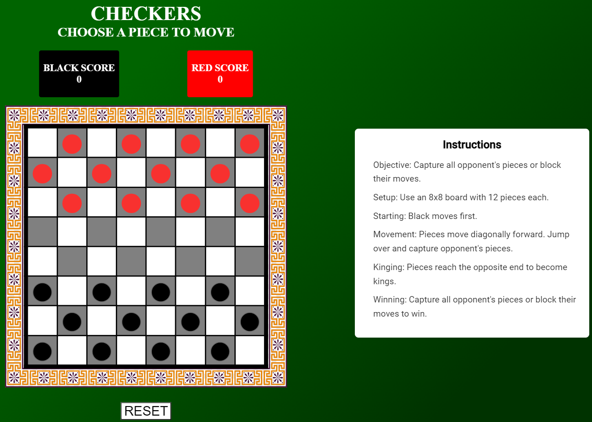

## **Game name : CHECKERS**

#### **User story**
- The checkers game should accessible through the website.
- The rules must be written clearly on the side of the board.
- The user interface must be easy to use and the pieces must be easy to track.
- The game should provide a feedback of the winner.
- There should be a reset button to set the pieces to there default location.

#### **Pseudocode**
- Setting up the visual board 
- Setting up a coordinate system to track the pieces on the board.
- Creating a rendering function to render the changes made on the board.
- Creating a function to show whose turn it is.
- Creating a function to show the legal moves and to allow the player to make moves.
- Creating a function for capturing dynamics.
- Creating a function to check for the winner.

I used HTML,CSS and JavaScript 
Planning to add more features like turn indicator , timer and AI Player.